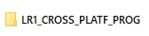
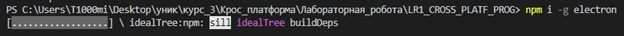
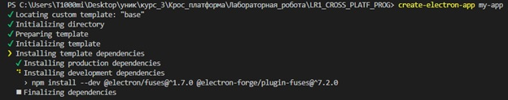
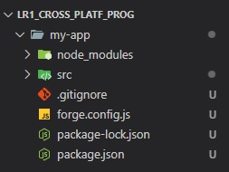
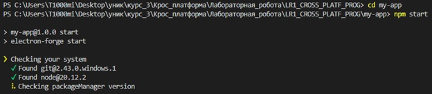
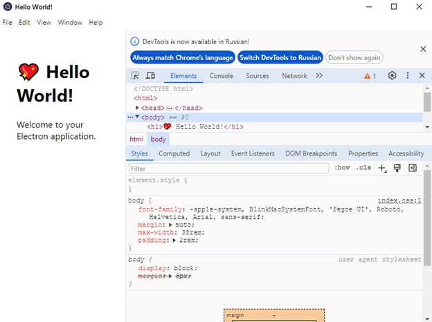

# Лабораторна робота №1

# Тема: Базова концепція фреймворку Electron

## Задача №1 - Перед початком роботи необхідно встановити Node.js

Після вставновлення Node.js потрібено перевірити працює технологія ци ні. Це можно зробити написавши команду:
``` cmd
    node -v
```

Та команду:

``` cmd
    npm -v
```

Ці команди вивидять версии Node.js та Node Package Manager відповідно. Результат роботи цих команд представлено на рисунку 1.1 (в залежності від версії результат може бути різним, головне щоб небуло помилки).


<br/>рисунку 1.1 - результат роботи команд

## Задача №2 - Створіть на комп'ютері каталог (наприклад, папка Electron)

На рисунку 1.2 представелно створений католог "LR1_CROSS_PLATF_PROG"


<br/>
рисунку 1.2 - створений новий католог католог

## Задача №3 - Встановіть Electron, використовуючи термінал у редакторі коду (VS code)

На рисунку 1.3 представелно глобальне встановлення Electron за допомогою Node Package Manager командую:

``` cmd
    npm i -g electron
```


<br/>
рисунку 1.3 - глобальне встановлення Electron

## Задача №4 - Встановіть ElectronForge

На рисунку 1.4 представелно глобальне встановлення ElectronForge за допомогою Node Package Manager командую:

``` cmd
    npm i -g create-electron-app
```


<br/>
рисунку 1.4 - глобальне встановлення ElectronForge

## Задача №5 - Ініціалізуємо новий проект


<br/>
рисунку 1.5 -


<br/>
рисунку 1.6 -

## Задача №6 - Запуск програми


<br/>
рисунку 1.7 -


<br/>
рисунку 1.8 -