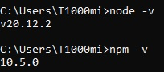

# Лабораторна робота №1

# Тема: Базова концепція фреймворку Electron

## Задача №1 - Перед початком роботи необхідно встановити Node.js

Після вставновлення Node.js потрібено перевірити працює технологія ци ні. Це можно зробити написавши команду:
``` cmd
    node -v
```

Та команду:

``` cmd
    npm -v
```

Ці команди вивидять версии Node.js та Node Package Manager відповідно. Результат роботи цих команд представлено на рисунку 1.1 (в залежності від версії результат може бути різним, головне щоб небуло помилки).


рисунку 1.1 - результат роботи команд

## Задача №2 - Створіть на комп'ютері каталог (наприклад, папка Electron)
## Задача №3 - Встановіть Electron, використовуючи термінал у редакторі коду (VS code)
## Задача №4 - Встановіть ElectronForge
## Задача №5 - Ініціалізуємо новий проект
## Задача №6 - Запуск програми